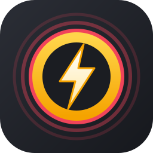

  

<h1 align="center">SkillSnap</h1>

  <b>Never miss an extraction skillcheck again.</b> 
  SkillSnap watches your screen and presses Space at exactly the right moment.

  <a href="https://github.com/brageat/skillsnap/releases/latest"><b>⬇️ Download</b></a>

- 🎯 **Handles both skillcheck types.** The **circle** (red ring shrinks onto yellow) and the default **bar** (red marker slides into the yellow zone).
- 🧠 **Adapts to any speed.** It measures how fast each check moves and presses ahead of time, so slow and fast checks both hit.
- 📊 **Mini stats HUD.** A click-through overlay with presses, skillchecks, misses, speed and run time.
- ⌨️ **Any toggle key.** Pick your own key; F6 by default.
- 🌙 **Dark mode** and a clean settings menu. Your settings are saved.
- 🖱️ **Keyboard only.** It never moves your mouse.

## Download
### ⬇️ [Download the latest release](https://github.com/brageat/skillsnap/releases/latest)

1. Install **[AutoHotkey v2](https://www.autohotkey.com/)**, the free, official program that runs the script.
2. Download **`SkillSnap.ahk`** from the release.
3. Double-click it.

> No exe to trust: `SkillSnap.ahk` is a plain text file, so you can open it in Notepad and read exactly what it does.

## Use
1. Run Roblox in **windowed or borderless fullscreen**.
2. Press **F6** (or click **Start**). The HUD shows **● BOT ON**.
3. Start an extraction and let SkillSnap handle the skillchecks.

### Tuning
The **"Press X ms ahead"** slider makes up for your PC's input lag. The default is 45 ms.
- Presses land **too early**: lower the number.
- Presses land **too late**: raise the number.

Works at any screen resolution.

## Disclaimer
Using macros may break Roblox's or the game's rules. Use at your own risk.

## License
[MIT](LICENSE)
